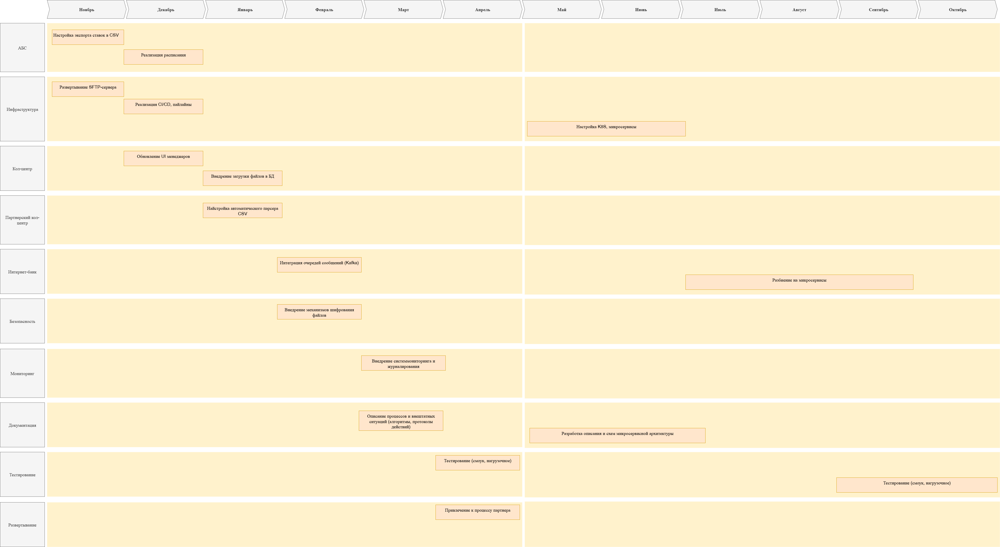

### **Название задачи:** 
### **Автор:**
### **Дата:**
### **Функциональные требования**
Опишите здесь верхнеуровневые Use Cases. Их нужно оформить в виде таблицы с пошаговым описанием:

|**№**|**Действующие лица или системы**|**Use Case**|**Описание**|
| :-: | :- | :- | :- |
|||||

| **№** | **Действующие лица или системы** | **Use Case**                                 | **Описание**                                                               |
|:-----:|:---------------------------------|:---------------------------------------------|:---------------------------------------------------------------------------|
|   1   | Менеджер кол-центра              | Получение актуальных ставок по депозитам	  | Кол-центр загружает файл с ставками через SFTP раз в 1 час.                |
|   2   | Партнёрский кол-центр            | Загрузка ставок по депозитам из файла        | Внешняя система получает файл по SFTP и обновляет локальную БД.            |
|   3   | АБС                              | Экспорт ставок по депозитам в файл           | АБС генерирует файл rates.csv каждые 30 минут и выгружает на SFTP-сервер.  |
|   4   | Клиент                           | Консультация по ставкам по депозитам         | Клиент звонит в кол-центр, менеджер просматривает ставки из локальной БД.  |

### **Нефункциональные требования**
Опишите здесь нефункциональные требования и архитектурно значимые требования.

|**№**|**Требование**|
| :-: | :- |
|||

| **№** | **Требование**                                                     |
|:-----:|:-------------------------------------------------------------------|
|   1   | Ставки должны обновляться раз в 1 час.                             |
|   2   | Простой SFTP-сервер < 0.01% времени.                               |
|   3   | Шифрование файлов при передаче (AES).                              |
|   4   | Поддержка формата CSV (для совместимости с партнёром).             |
|   5   | Журналирование ошибок передачи файлов (срок хранения до 30 дней).  |

### **Решение**
Приведите диаграммы контекста и контейнеров в модели C4. Опишите там основные компоненты и интеграции всех элементов решения. 

[C4_Diagram_Container.puml](C4_Diagram_Container.puml)
[C4_Diagram_Context.puml](C4_Diagram_Context.puml)

Также опишите, какой логикой вы руководствовались в ходе принятия решений и выбора технологий. Не забывайте, что необходимо учесть все функциональные и нефункциональные требования.
Язык C# выбран, как эффективный с поддержкой высокой нагрузки, достаточно легко масштабируемый с кроссплатформенными возможностями. Kafka легко интегрируется и имеет высокие показатели отказоустойчивости и масштабируемости. Безопастность хранения и доступа это важный элемент системы, AES-256 и TLS, например 1.2 обеспечивает хорошую степень шифрования. Postgres, как реляционная база эффективна и обладает высокими характеристиками, кроме того, хорошо бекапируется. ReactJS, Ios, Android является популярными системами для пользователей.
Linux обладает высокой степенью управления и показателями производительности.

### **Альтернативы**
Опишите здесь наиболее важные альтернативные решения.
|       **Вариант**          | **Достоинства**                     | **Недостатки**                                                |
|:--------------------------:|:------------------------------------|:-------------------------------------------------------------------------|
| REST API для кол-центра	 | Реальное время обновления ставок.   | Партнёр не поддерживает API. Риск перегрузки АБС.	                      |
| Общая БД	                 | Нет задержек.                       | Нарушает изоляцию систем. Небезопасно для внешнего партнёра.	          |
| Email-рассылка 	         | Простота.                           | Нет шифрования, риск потери писем, ошибки почтового сервиса.             |

**Недостатки, ограничения, риски**

Подробно опишите здесь недостатки, ограничения и риски выбранного решения.

Технические ограничения

| **Категория**       | **Проблема**                                   | **Риск**                                                         |
|:--------------------|:-----------------------------------------------|:-----------------------------------------------------------------|
| Производительность  | Ручная обработка файлов                        | Количество продуктов влияет на задержки в обновлении данных      |
| Безопасность        | Перехват данных при передаче                   | Потенциальная компрометация финансовой информации                |
| Надёжность          | Сбой SFTP-сервера                              | Прерывание процесса обмена ставками по депозитам между системами |
| Согласованность     | Разные форматы данных у партнёров              | Обработка ставок партнёрскими системами могут привести к сбою    |
| Контроль            | Отсутствие журналирование операций             | Потенциальные проблемы при передаче данных из-за отсутствия логов|
| Актуальность данных | Задержка обновления ставок по депозитам        | В кол-центре ставки за час могут быть не актуальными             |

**Road map**

[RoadMap_bank_Standart.drawio](RoadMap_bank_Standart.drawio)

